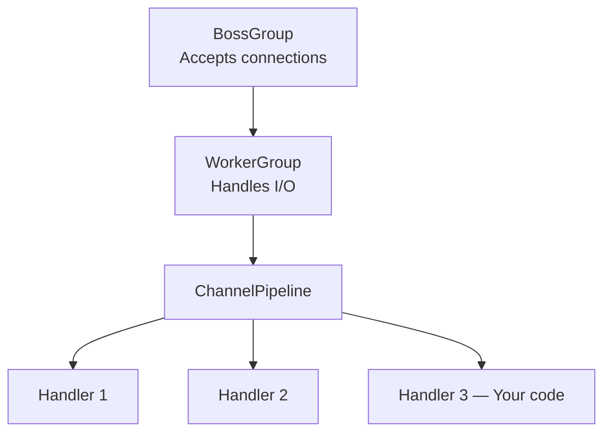
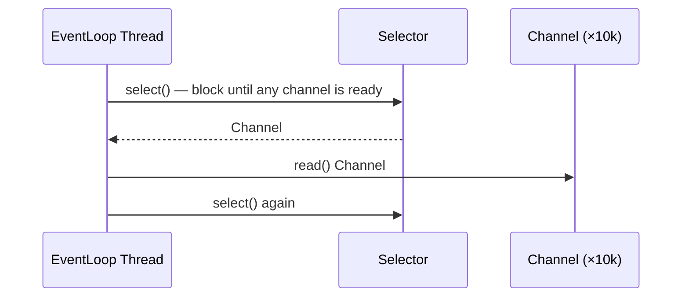
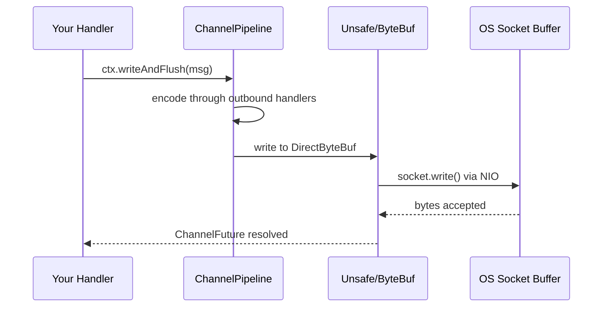

# Building Block Reference

This document defines the 11 content building blocks available for chapter construction. When writing a Chapter Brief (Phase 2.5), select the blocks that best serve each chapter's teaching objective and arrange them in the optimal sequence.

**Every chapter MUST start with HOOK and end with RECAP-BRIDGE.** All other blocks are chosen and ordered per-chapter based on what the content demands.

---

## Block Index

| Block | Role | Section Title (zh-CN / en) | Required? |
|-------|------|---------------------------|-----------|
| [HOOK](#hook) | Open with a compelling question or scenario | *(no title)* | Every chapter |
| [BIG-PICTURE-DIAGRAM](#big-picture-diagram) | Establish macro-level spatial understanding | 整体架构 / System Architecture | Architecture/overview chapters |
| [ANALOGY](#analogy) | Lower the barrier to abstract concepts | 类比说明 / Analogy Explanation | When mechanism is hard to intuit |
| [MECHANISM](#mechanism) | Explain the "why" behind how something works | 原理解析 / How It Works | When surface behavior needs deep explanation |
| [CODE-WALKTHROUGH](#code-walkthrough) | Read and parse existing codebase code | 核心代码解析 / Code Walkthrough | Core of most deep-dive chapters |
| [MINI-DEMO](#mini-demo) | Minimal skeleton implementation that strips framework noise | 从 0-1 手动 Demo 实现 / Demo Implementation from 0-1 | After MECHANISM, to crystallize core principle |
| [DESIGN-DECISION](#design-decision) | Document trade-offs and rationale for architectural choices | 设计决策 / Design Decisions | When real choices were made |
| [SEQUENCE-FLOW](#sequence-flow) | Show a complete request/data processing path | 执行流程 / Execution Flow | Cross-module interactions, async flows |
| [COMPARISON](#comparison) | Side-by-side contrast of two approaches or components | 对比分析 / Comparison | When boundary or trade-off needs to be sharp |
| [PATTERN-TOUR](#pattern-tour) | Show one pattern appearing across multiple code locations | 模式全览 / Pattern Tour | Cross-cutting concerns chapters |
| [RECAP-BRIDGE](#recap-bridge) | Summarize this chapter and introduce the next chapter's problem | *(no title)* | Every chapter |

---

## HOOK

**Section Title:** None — HOOK content appears directly after the chapter `#` heading with no `##` section title. It is the chapter's opening prose, not a named section.

**Role:** Open each chapter with a question or scenario that gives the reader a reason to keep reading. The hook frames what problem this chapter solves.

**When to use:** Every chapter, always first.

**Content rules:**
- Must contain a single sharp question or concrete scenario — not a topic sentence
- 2-4 sentences maximum; do not preview the chapter structure
- Must create cognitive tension: something the reader doesn't yet know how to answer
- Forbidden: "In this chapter, we will..." — never announce the structure
- Forbidden: more than one question; one hook, one direction

**Typical structure:**
```
> 🔑 [One sharp question]

[1-2 sentences that make the problem feel real and concrete]
[1 sentence that hints at why the answer is non-obvious]
```

**Example:**
```markdown
> 🔑 How does Netty handle 10,000 concurrent connections with a handful of threads?

Traditional Java blocking I/O assigns one thread per connection. At 10,000
connections, the thread scheduling overhead alone would saturate the CPU.
Netty's Reactor model takes a fundamentally different approach — and
understanding it changes how you think about I/O-bound systems entirely.
```

**Relationship to other blocks:**
- Always first in the chapter
- Usually followed by BIG-PICTURE-DIAGRAM or MECHANISM depending on how abstract the topic is

---

## BIG-PICTURE-DIAGRAM

**Section Title:**
- zh-CN: `整体架构`
- en: `System Architecture`

**Role:** Give the reader a spatial map of the system or module before diving into details. Establishes the "where are we" orientation.

**When to use:**
- Architecture chapters and overview chapters (near mandatory)
- Start of module deep-dive chapters when the module has non-trivial internal structure
- Any time the reader needs a mental model before code makes sense

**Content rules:**
- Must use a Mermaid diagram (graph TD, C4, or architecture diagram preferred)
- Diagram scope: the whole system or the module being introduced — not a single function
- 5-12 nodes maximum; more than 12 signals the diagram is trying to do too much
- Must include a 2-3 sentence explanation after the diagram: what the diagram shows and what the reader should notice
- Forbidden: putting a BIG-PICTURE-DIAGRAM mid-chapter (it belongs at the top)
- Forbidden: showing implementation detail at this level (save that for CODE-WALKTHROUGH)

**Typical structure:**
```
[Mermaid diagram — system or module overview]

[Sentence stating what the diagram shows]
[Sentence pointing out the most important structural relationship]
[Optional: sentence noting what is intentionally excluded from this view]
```

**Example:**
```markdown


The BossGroup accepts incoming TCP connections and hands them off to the
WorkerGroup. Each accepted connection gets its own ChannelPipeline — a
chain of handlers that process inbound and outbound events. Your application
code lives entirely in the last handler; everything above it is Netty's concern.
```

**Relationship to other blocks:**
- Follows HOOK
- Usually followed by MECHANISM (to explain why it's structured this way) or CODE-WALKTHROUGH (to show the key code paths)

---

## ANALOGY

**Section Title:**
- zh-CN: `类比说明`
- en: `Analogy Explanation`

**Role:** Use a concrete, everyday metaphor to make an abstract concept intuitively graspable before the technical explanation lands.

**When to use:**
- The mechanism or design is genuinely counter-intuitive
- The concept has no obvious parallel in the reader's prior experience
- MECHANISM alone would require too much prerequisite knowledge to land cleanly

**Content rules:**
- The analogy must map cleanly: every key element in the analogy must correspond to a real component
- State the mapping explicitly: "The waiter = MCP Server, the kitchen = external service"
- Maximum 1 analogy per concept; do not stack analogies
- Keep the analogy to 3-5 sentences; it is setup, not the main act
- Forbidden: recycling the same analogy (restaurant, factory, post office) across multiple chapters
- Forbidden: using an analogy that requires more explanation than the original concept

**Typical structure:**
```
[Setup: familiar scenario in 1-2 sentences]
[Mapping: explicit correspondence between scenario elements and technical components]
[Payoff: what the analogy reveals that makes the technical concept clearer]
```

**Example:**
```markdown
Think of a reactor as a hotel concierge desk with one very fast concierge.
Instead of following each guest to their room (a thread per connection),
the concierge stays at the desk and responds only when a guest rings —
request accepted, task delegated, back to waiting. The concierge (event
loop) is the single thread; the rings (I/O events) are the triggers;
the guest rooms (handlers) are your application logic.
```

**Relationship to other blocks:**
- Usually precedes MECHANISM (analogy first, precise explanation second)
- Avoid placing immediately before or after another ANALOGY
- Do not place after CODE-WALKTHROUGH (analogies belong before, not after, technical detail)

---

## MECHANISM

**Section Title:**
- zh-CN: `原理解析`
- en: `How It Works`

**Role:** Explain the internal working principle of a concept — not what it does, but why it works the way it does and what design problem that solves.

**When to use:**
- The chapter covers runtime behavior, protocol internals, compiler/framework internals
- A CODE-WALKTHROUGH shows what the code does but cannot explain why it was designed that way
- The reader needs a mental model that lets them predict behavior, not just use the API

**Content rules:**
- Must open with a problem statement: what challenge does this mechanism address
- Must include at least one diagram (flowchart, sequence, or architecture) showing the mechanism
- Must connect mechanism back to observable behavior: "this is why you see X when Y happens"
- Depth limit: explain no more than 3 layers deep in one block; split into multiple blocks if needed
- Forbidden: explaining only "what" without "why this design"
- Forbidden: using pseudocode as a substitute for a real diagram

**Typical structure:**
```
[Problem statement: what does this mechanism exist to solve]
[Diagram: visual representation of the mechanism]
[Layer-by-layer explanation: from observable behavior down to internal cause]
[Observable consequence: how this explains something the reader has seen]
```

**Example:**
```markdown
The core problem: how do you multiplex thousands of I/O streams onto a
small thread pool without blocking threads on slow network operations?



The `select()` call blocks until at least one channel is ready for I/O.
The thread never waits on a specific connection — it waits on *any* event
from *any* connection. This is why a single EventLoop thread can serve
10,000 channels: it spends zero time blocked on any one of them.
```

**Relationship to other blocks:**
- Usually follows HOOK or BIG-PICTURE-DIAGRAM
- Typically followed by CODE-WALKTHROUGH (see the real implementation) or MINI-DEMO (verify with skeleton code)
- Avoid placing immediately adjacent to another MECHANISM block without a CODE-WALKTHROUGH in between

---

## CODE-WALKTHROUGH

**Section Title:**
- zh-CN: `核心代码解析`
- en: `Code Walkthrough`

> **Multi-block note:** If a chapter contains multiple CODE-WALKTHROUGH blocks, replace the default title with a specific semantic title for each (e.g., zh-CN: `请求处理逻辑` / `连接管理逻辑`; en: `Request Handling` / `Connection Management`). Never use numbered variants like `核心代码解析 1`.

**Role:** Show actual codebase code and guide the reader through it, focusing on design decisions and non-obvious logic — not line-by-line narration.

**When to use:**
- The chapter needs to ground abstract explanations in real implementation
- A function, class, or flow in the codebase directly embodies the chapter's teaching point
- The reader needs to know where in the code a concept lives

**Content rules:**
- Code must be copied verbatim from the codebase — no modifications, no simplifications
- Always include the file path as the first comment in the code block
- Maximum 50 lines per code block; use `// ...` ellipsis for omitted sections
- After the code block: explain design decisions, not syntax — why this structure, not what each line does
- For complex algorithms or control flow, use a numbered walkthrough after the code
- Forbidden: showing modified or "cleaned up" code
- Forbidden: explaining what a variable is or what a basic language construct does
- Forbidden: narrating code line by line without connecting to design rationale

**Typical structure:**
```
[1-sentence setup: what this code shows and why it matters]

[Code block with file path]

[Design explanation: 3-5 bullet points on decisions, trade-offs, non-obvious choices]
```

**For complex algorithms, add a numbered walkthrough:**
```
[Code block]

The algorithm works in three stages:
1. [Stage 1: what happens and why]
2. [Stage 2: what happens and why]
3. [Stage 3: what happens and why]
```

**Example:**
```markdown
The `NioEventLoop` run loop is the heart of Netty's threading model — a
single method that never returns until the channel is closed.

```java
// io/netty/channel/nio/NioEventLoop.java
protected void run() {
    for (;;) {
        try {
            switch (selectStrategy.calculateStrategy(selectNowSupplier, hasTasks())) {
                case SelectStrategy.CONTINUE: continue;
                case SelectStrategy.SELECT:
                    select(wakenUp.getAndSet(false));
                    // fall through
                default:
            }
            processSelectedKeys();
            runAllTasks(ioRatio);
        } catch (Throwable t) {
            handleLoopException(t);
        }
    }
}
```

The infinite loop is intentional: this thread lives as long as the channel.
`calculateStrategy` checks whether there are pending tasks before blocking
on `select()` — if the task queue is non-empty, it uses `selectNow()`
(non-blocking) instead of `select()` (blocking). `runAllTasks(ioRatio)`
enforces the I/O-to-task time ratio, preventing task backlog from starving
I/O processing.
```

**Relationship to other blocks:**
- Usually follows MECHANISM or BIG-PICTURE-DIAGRAM
- Can be followed by MINI-DEMO (if the framework code is dense and a skeleton helps clarify)
- Can be followed by DESIGN-DECISION (to table the choices visible in the code)

---

## MINI-DEMO

**Section Title:**
- zh-CN: `从 0-1 手动 Demo 实现`
- en: `Demo Implementation from 0-1`

**Role:** A purpose-written minimal implementation that strips away framework complexity to expose the bare-bones core of a mechanism. The reader sees the principle, not the production code.

**When to use:**
- The framework's real implementation is too dense to reveal the core idea (e.g., Netty's NioEventLoop is 800 lines)
- A CODE-WALKTHROUGH showed what the code does, but the mechanism is still opaque
- The teaching point can be demonstrated in under 60 lines of standard library code

**Content rules:**
- Code is written for this ebook — it does not exist in the codebase
- Must use only standard library (no framework dependencies); the goal is to expose primitives
- Maximum 60 lines; ruthlessly cut anything not essential to the core mechanism
- Annotate each structural section with a comment: `// Stage 1: register interest`
- Must include a "What this omits" note: explicitly state what the real implementation adds
- Forbidden: using the MINI-DEMO as a tutorial ("now try adding X"); it is a lens, not an exercise
- Forbidden: code that requires setup outside the snippet to understand

**Typical structure:**
```
[1-2 sentences: what this demo isolates and why the real code obscures it]

[Code block — pure standard library, annotated sections, ≤60 lines]

**What this omits:** [2-3 bullet points listing what the real implementation adds:
thread safety, error handling, performance tuning, etc.]
```

**Example:**
```markdown
Netty's NioEventLoop is 800 lines. Here is the same select-process loop
in 30 lines of plain Java NIO — stripped to the mechanism that matters.

```java
// Minimal Reactor: select → dispatch, standard Java NIO only
Selector selector = Selector.open();
ServerSocketChannel server = ServerSocketChannel.open();
server.configureBlocking(false);
server.bind(new InetSocketAddress(8080));
server.register(selector, SelectionKey.OP_ACCEPT);  // Stage 1: register interest

for (;;) {
    selector.select();                               // Stage 2: block until any event

    for (SelectionKey key : selector.selectedKeys()) {
        if (key.isAcceptable()) {
            SocketChannel client = server.accept();
            client.configureBlocking(false);
            client.register(selector, SelectionKey.OP_READ);  // Stage 3: register new channel
        } else if (key.isReadable()) {
            SocketChannel client = (SocketChannel) key.channel();
            ByteBuffer buf = ByteBuffer.allocate(256);
            client.read(buf);                        // Stage 4: handle the event
        }
    }
    selector.selectedKeys().clear();
}
```

**What this omits:** thread pool for handlers (Netty uses a separate WorkerGroup),
boss/worker separation for scalability, and all error handling and channel lifecycle
management.
```

**Relationship to other blocks:**
- Usually follows MECHANISM or CODE-WALKTHROUGH
- Not suitable as a chapter opener; always preceded by context-setting blocks
- Rarely needs to be followed by another MINI-DEMO in the same chapter

---

## DESIGN-DECISION

**Section Title:**
- zh-CN: `设计决策`
- en: `Design Decisions`

**Role:** Document an explicit architectural or technical choice — what options existed, what was chosen, and why.

**When to use:**
- The codebase made a non-obvious choice (e.g., chose NIO over AIO, chose immutable over mutable)
- There are comments, ADRs, or git history suggesting a deliberate trade-off
- The reader would reasonably wonder "why not X instead?"

**Content rules:**
- Must use a table: columns are Approach | Pros | Cons | Verdict
- The "Verdict" column must state the actual choice and a one-line rationale
- At least 2 alternatives must be shown (the chosen approach + at least one rejected alternative)
- Add a 2-3 sentence prose explanation after the table for the most important trade-off
- Forbidden: showing a table where the chosen option is obviously better in every dimension (that's not a decision, it's a sales pitch)
- Forbidden: listing trade-offs without naming which was the actual deciding factor

**Typical structure:**
```
[1-sentence setup: what decision was made and where in the codebase]

| Approach | Pros | Cons | Verdict |
|----------|------|------|---------|
| [Chosen] | ... | ... | ✅ Chosen — [one-line reason] |
| [Alt 1]  | ... | ... | ❌ [one-line reason rejected] |
| [Alt 2]  | ... | ... | ❌ [one-line reason rejected] |

[2-3 sentences on the most important trade-off — what was given up and why it was worth it]
```

**Example:**
```markdown
Netty chose NIO (non-blocking) over AIO (asynchronous) for its I/O model,
a decision baked into NioEventLoop.

| Approach | Pros | Cons | Verdict |
|----------|------|------|---------|
| **NIO (Selector)** | Predictable, cross-platform, battle-tested | Requires explicit event loop | ✅ Chosen — consistent behavior on Linux, macOS, Windows |
| **AIO (CompletionHandler)** | OS handles scheduling | Inconsistent OS support, harder to debug | ❌ Linux AIO implementation is unreliable in practice |
| **BIO (blocking)** | Simple mental model | Thread-per-connection, doesn't scale | ❌ Collapses at 10k+ connections |

The decisive factor was Linux: AIO on Linux uses `epoll` internally anyway,
so the performance gain over NIO is negligible while the debugging complexity
increases significantly. Netty gets epoll behavior through NIO's Selector on
Linux without the portability cost.
```

**Relationship to other blocks:**
- Usually follows CODE-WALKTHROUGH (the code revealed a choice; this block explains it)
- Can follow MECHANISM (the mechanism has design alternatives worth surfacing)
- Rarely appears at the start of a chapter

---

## SEQUENCE-FLOW

**Section Title:**
- zh-CN: `执行流程`
- en: `Execution Flow`

**Role:** Show the complete path of a request, event, or data through the system — across module boundaries, in temporal order.

**When to use:**
- The chapter's key insight is about how components coordinate, not how any one component works internally
- A request path crosses 3+ modules or layers
- There is a meaningful async or multi-step flow that a static diagram can't capture

**Content rules:**
- Must use a Mermaid sequence diagram or flowchart (sequence preferred for request/response flows)
- Show both the happy path and at least one error/edge path if the error handling is architecturally significant
- 8-12 interactions maximum; more than 12 signals the diagram needs to be split
- After the diagram: 3-5 bullet points on the most architecturally significant moments in the flow
- Forbidden: sequence diagrams that show only one participant (use CODE-WALKTHROUGH instead)
- Forbidden: including implementation details like variable names in the diagram

**Typical structure:**
```
[1-sentence framing: what flow this diagram traces and why it matters]

[Mermaid sequence or flowchart]

Key points in this flow:
- [Most important architectural moment 1]
- [Most important architectural moment 2]
- [Most important architectural moment 3]
```

**Example:**
```markdown
A write from user code travels through four layers before hitting the
network — each layer adds something the layer above doesn't need to know about.



Key points:
- `writeAndFlush` is non-blocking: it returns a `ChannelFuture` immediately
- The pipeline traversal is in reverse order for outbound events (last handler first)
- `DirectByteBuf` avoids a copy from heap to native memory before the OS write
```

**Relationship to other blocks:**
- Often follows BIG-PICTURE-DIAGRAM (big picture first, then one specific flow through it)
- Can follow CODE-WALKTHROUGH (code shown, now trace its runtime behavior)
- Usually followed by CODE-WALKTHROUGH for the most important step in the flow

---

## COMPARISON

**Section Title:**
- zh-CN: `对比分析`
- en: `Comparison`

**Role:** Place two approaches, modules, or implementations side by side to make their differences sharp and the trade-offs explicit.

**When to use:**
- Two modules share a responsibility but handle it differently (e.g., two caching strategies)
- An old approach exists alongside a new one in the same codebase
- The reader needs to understand the boundary between two similar components

**Content rules:**
- Side-by-side structure preferred: either a table or two labeled code blocks
- Must name the deciding criterion: what makes one better than the other in this context
- Must be grounded in the actual codebase: both sides must exist there (or one must be the thing being replaced)
- 2-3 sentence prose conclusion after the comparison stating when to use each
- Forbidden: comparing against a hypothetical that doesn't exist in the codebase
- Forbidden: a comparison where one option is strictly better in every dimension (use DESIGN-DECISION instead)

**Typical structure:**
```
[1-sentence setup: what two things are being compared and why the distinction matters]

[Side-by-side table or two labeled code blocks]

[2-3 sentence conclusion: the deciding criterion and when each applies]
```

**Example:**
```markdown
`HeapByteBuf` and `DirectByteBuf` both implement `ByteBuf` but sit on
opposite sides of the JVM memory boundary — with very different cost profiles.

| | HeapByteBuf | DirectByteBuf |
|---|---|---|
| **Memory location** | JVM heap | Native memory (off-heap) |
| **Allocation cost** | Low | High (OS call) |
| **GC pressure** | Yes | None |
| **I/O performance** | Extra copy to native before write | Direct write, no copy |
| **Best for** | Short-lived buffers, frequent allocation | Long-lived I/O buffers |

Use `HeapByteBuf` for buffers created inside handlers that are processed
and discarded quickly. Use `DirectByteBuf` for buffers that will be written
to the network — Netty's pipeline automatically uses direct memory for the
final write stage, which is why `PooledDirectByteBuf` dominates the
profiler output in write-heavy applications.
```

**Relationship to other blocks:**
- Usually follows CODE-WALKTHROUGH or MECHANISM (once the reader understands one thing, compare it)
- Can follow BIG-PICTURE-DIAGRAM (diagram showed two components exist; this block explains their difference)
- Avoid chaining COMPARISON directly after DESIGN-DECISION (both are analytical; the reader needs a break)

---

## PATTERN-TOUR

**Section Title:**
- zh-CN: `模式全览`
- en: `Pattern Tour`

**Role:** Show one design pattern, convention, or strategy appearing across multiple locations in the codebase. Builds horizontal understanding: "this is how the whole system handles X."

**When to use:**
- Cross-cutting concerns chapters (error handling, logging, configuration, auth)
- When a pattern is so pervasive it defines the codebase's character
- When understanding the pattern requires seeing it in 3+ different contexts to internalize it

**Content rules:**
- Show at least 3 code locations implementing the same pattern
- Each location gets a short code block (10-15 lines max) + 1-2 sentences on what's the same and what's different
- Must end with a pattern summary: the invariant (what never changes) and the variable (what each implementation adapts)
- Forbidden: showing only 1-2 locations (that's CODE-WALKTHROUGH territory)
- Forbidden: padding with locations that don't add new insight about the pattern

**Typical structure:**
```
[1-2 sentences: name the pattern and why it deserves a tour]

**Location 1: [context]**
[Short code block]
[1 sentence: what this instance of the pattern shows]

**Location 2: [context]**
[Short code block]
[1 sentence: how this differs from Location 1]

**Location 3: [context]**
[Short code block]
[1 sentence: what this adds to the pattern picture]

**The invariant:** [what stays the same across all locations]
**The variable:** [what each location adapts to its context]
```

**Example:**
```markdown
Every Netty handler that can fail follows the same error propagation
contract: catch locally if recoverable, call `ctx.fireExceptionCaught()`
if not. Three locations show how this plays out differently.

**Location 1: Decoder (protocol error)**
```java
// io/netty/handler/codec/ByteToMessageDecoder.java
} catch (DecoderException e) {
    throw e;
} catch (Exception e) {
    throw new DecoderException(e);
}
```
Protocol errors are wrapped in `DecoderException` and rethrown — the
pipeline's exception handler decides what to do with them.

**Location 2: Business handler (application error)**
```java
// example/EchoServerHandler.java
public void exceptionCaught(ChannelHandlerContext ctx, Throwable cause) {
    cause.printStackTrace();
    ctx.close();
}
```
Application code catches at the tail of the pipeline and closes the
channel — a clean shutdown rather than silent failure.

**Location 3: SSL handler (security error)**
```java
// io/netty/handler/ssl/SslHandler.java
ctx.fireExceptionCaught(new SSLException("..."));
ctx.close();
```
Security errors propagate the exception AND close immediately — no
chance for the pipeline to attempt recovery.

**The invariant:** errors always travel down the pipeline via `fireExceptionCaught()`.
**The variable:** whether to wrap, log, close, or retry depends on the handler's layer.
```

**Relationship to other blocks:**
- Typically the central block in cross-cutting concern chapters
- Often preceded by HOOK + a brief BIG-PICTURE-DIAGRAM showing where this concern lives in the architecture
- Usually followed by DESIGN-DECISION (why this pattern was chosen over alternatives)

---

## RECAP-BRIDGE

**Section Title:** None — RECAP-BRIDGE content appears as the chapter's closing prose with no `##` section title. It is a 2-4 sentence forward-linking paragraph, not a named section. Never add a heading like "总结" or "Summary" above it.

**Role:** Close the chapter by consolidating what was learned and opening the door to the next chapter's problem — not a summary, but a forward pass.

**When to use:** Every chapter, always last.

**Content rules:**
- 2-4 sentences maximum
- Must name 1-2 specific things the reader now understands (not a bullet list of everything covered)
- Must end by naming the specific problem the next chapter solves — and why it's necessary given what was just learned
- Forbidden: bullet-point summaries ("In this chapter we covered: 1. 2. 3.")
- Forbidden: generic transitions ("Now we move on to the next topic")
- Forbidden: introducing new information not covered in the chapter
- Exception: the final chapter ends with extension points or open questions instead of a next-chapter bridge

**Typical structure:**
```
[1-2 sentences: what the reader now understands that they didn't before]
[1-2 sentences: what this understanding reveals is still missing — the next chapter's problem]
```

**Example:**
```markdown
The Reactor model explains how Netty multiplexes thousands of connections
onto a handful of threads — but it says nothing about what those threads
actually do with the data. Raw bytes arrive at the EventLoop; your
application expects structured messages. The next chapter examines the
ChannelPipeline: the chain of handlers that transforms bytes into domain
objects and routes events to the right application code.
```

**Relationship to other blocks:**
- Always last in the chapter
- No block follows RECAP-BRIDGE
