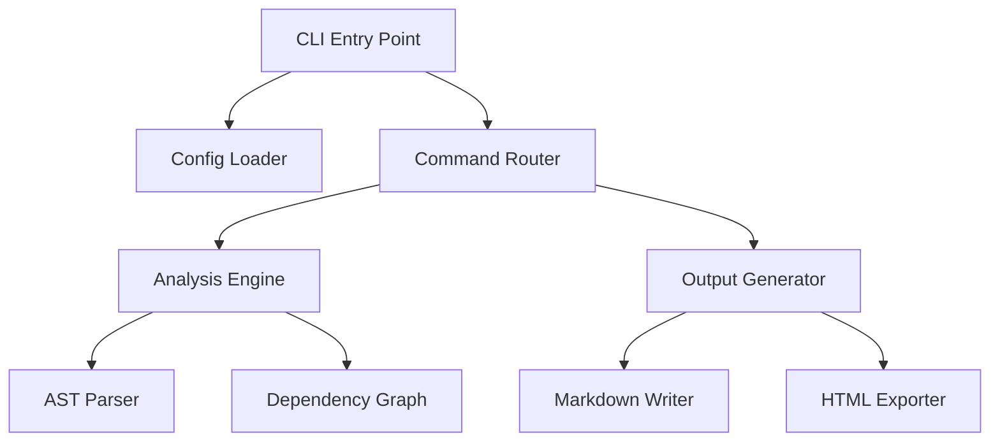

# Content Guidelines for Technical Ebook Generation

This document defines the writing standards for AI agents generating technical ebook content from codebases. Follow these guidelines to produce professional, O'Reilly-style technical documentation.

## Target Audience

**Developers with programming experience.** Assume readers know:
- Programming fundamentals (variables, functions, classes, loops)
- Common design patterns (Factory, Observer, Singleton)
- Version control and command-line tools
- How to read stack traces and debug code

**Do not explain:**
- What a function is
- How to declare variables
- Basic syntax of the language
- Standard library APIs without context

**Do explain:**
- Why this architecture over alternatives
- Trade-offs in design decisions
- Non-obvious implementation details
- How components interact across modules

## Content Density

Technical readers expect high information density. Every paragraph should deliver value.

**Good:**
> The parser uses a two-pass strategy. The first pass builds a symbol table while ignoring forward references. The second pass resolves all references using the completed table. This trades memory (storing the entire AST) for simplicity (no complex backpatching logic).

**Bad:**
> The parser is an important part of the system. It reads the code and processes it. First, it goes through the code once. Then, it goes through again. This helps it understand the code better.

**Guidelines:**
- Cut filler phrases ("it's important to note", "as we can see", "basically")
- Front-load key insights in the first sentence
- Use concrete examples over abstract descriptions
- Aim for 60-70% code/diagrams, 30-40% prose

## Divide the importance of knowledge points
In a technical book, you don't need to cover all the knowledge points. ** Note: Split important knowledge **. Distinguish the importance of knowledge points. For important knowledge points, more space should be spent on describing them, so that readers can read and learn with more focus.

Criteria for judging important knowledge points include:
- Knowledge points involved in the main body/core module in the framework
- Used repeatedly in codebase and relied on in many other places
- Can reflect the underlying interaction, mechanism design, and core ideas of the framework
- Features and modules highlighted in codebase README.md

## Multi-element content display
Although the output is technical articles, don't write lengthy technical terms and words when generating content. ** Note: people often lack patience when reading large amounts of text **. Please follow the following guidelines when designing chapter content:
- The proportion of words in each chapter shall not exceed 60%.
- A single paragraph should not exceed 10 lines.
- When a concept is written too much, replace it with Mermaid's class diagram/flow diagram/sequence diagram and other elements.
- Multiple elements are embedded between paragraphs to avoid the separation of text areas and diagram areas.

**Note: diagrams should be concise rather than numerous.** Do not display a large number of diagrams just to fill the remaining space. Each diagram should accurately represent the corresponding knowledge point and select the most appropriate type of diagram for presentation.

Please refer to: references/rich-elements.md. for the content and examples of supported rich elements.

## Code Explanation Pattern

### 1. Code First, Explanation Second

Show the code block, then explain what it does. Never explain before showing.

**Structure:**
```
[Code block with full context]

The implementation does X by Y. Key points:
- Point 1 about design
- Point 2 about trade-offs
- Point 3 about edge cases
```

**Example:**

```typescript
export class TokenBuffer {
  private tokens: Token[] = [];
  private position: number = 0;

  peek(ahead: number = 0): Token | null {
    const index = this.position + ahead;
    return index < this.tokens.length ? this.tokens[index] : null;
  }
}
```

The `TokenBuffer` uses array indexing for O(1) lookahead. The `peek` method allows scanning ahead without consuming tokens, essential for predictive parsing. Returning `null` for out-of-bounds access avoids exceptions in the hot path.

### 2. Use Original Code Only

**Never modify, simplify, or "clean up" code for examples.** Copy exact code from the codebase, including:
- Comments as written
- Variable names as chosen
- Formatting and indentation
- Import statements if relevant

If code is too long, show the full function with ellipsis for unrelated sections:

```typescript
function processRequest(req: Request): Response {
  // ... authentication logic

  const result = validateInput(req.body);
  if (!result.valid) {
    return errorResponse(result.errors);
  }

  // ... processing logic
}
```

### 3. Walk Through Complex Logic

For algorithms or complex control flow, use step-by-step walkthroughs:

**Example:**

```typescript
function resolveImports(module: Module): void {
  const visited = new Set<string>();
  const stack: Module[] = [module];

  while (stack.length > 0) {
    const current = stack.pop()!;
    if (visited.has(current.id)) continue;
    
    visited.add(current.id);
    current.imports.forEach(imp => stack.push(imp.target));
  }
}
```

This iterative depth-first traversal avoids stack overflow for deep dependency trees. The algorithm:

1. Initializes a visited set to detect cycles
2. Uses an explicit stack instead of recursion
3. Pops the current module and marks it visited
4. Pushes all unvisited imports onto the stack
5. Terminates when the stack is empty

The `visited.has()` check in the loop prevents infinite loops in circular dependencies.

## Use metaphors to describe concepts
For some obscure concepts or interaction processes, use metaphors to explain them more vividly. Metaphors can use more common examples in life.


For example, for introducing the concept of MCP, the following metaphor can be used:
```
MCP Server is equivalent to adding an intermediate layer between AI Agents and external services. The Agent side only needs to request Mcp Server to obtain corresponding data from external services to expand context information.

It can be imagined as in a restaurant, where the original customer (Agent) wants to order food and needs to go to each kitchen (external service) to place an order in person.

Now with MCP Server, it is equivalent to the restaurant being equipped with an all-round waiter. Customers only need to place orders from the waiter. The waiter (MCP Server) is responsible for translating requirements into understandable instructions for each kitchen and coordinating the delivery of meals from multiple kitchens

Throughout the entire process, the customer (Agent) only deals with the waiter (Mcp Server) and does not need to understand the internal structure of the kitchen (external fu wu) at all. 

```

**Critical: No recycled metaphors** Don't use a metaphor to introduce all concepts, such as the restaurant metaphor. The metaphors of conceptual correspondence should be appropriate and naturally conceivable, and be easy to understand.
 

## Mermaid Diagrams for Architecture

Every chapter covering **inter-module relationships** must include at least one Mermaid diagram.

**Use diagrams for:**
- Data flow between modules
- Component dependencies
- State transitions
- Request/response cycles
- Class relationships (when non-trivial)

**Do not diagram:**
- Simple function calls within a module
- Trivial one-way dependencies
- Standard patterns (e.g., MVC) without customization

**Example:**



**Diagram guidelines:**
- Keep it focused: 5-15 nodes maximum
- Label edges when the relationship isn't obvious
- Use consistent node shapes (boxes for modules, diamonds for decisions)
- Place the diagram after introducing the components, before deep-diving into implementation

## Section Structure

Each section should cover **one core concept**. If you're explaining multiple unrelated ideas, split into separate sections.

**Section template:**
1. **Opening sentence**: State what this section covers
2. **Code example**: Show the implementation
3. **Explanation**: Walk through the code, focusing on design decisions
4. **Trade-offs** (if applicable): What was gained/lost with this approach
5. **Connection**: Link to the next section or concept

## Chapter Connections

Each chapter should end with a **connection paragraph** linking to the next chapter.

**Bad:**
> This concludes the parser implementation. Next, we'll look at the type checker.

**Good:**
> The parser produces an untyped AST with no semantic validation. A syntactically valid program might reference undefined variables or misuse types. The next chapter builds the type checker, which walks the AST to enforce type safety and resolve symbol references. This two-phase approach separates syntax analysis from semantic analysis, a classic compiler design pattern.

**Connection guidelines:**
- Explain why the next chapter is necessary (what's incomplete without it)
- Name the specific problem the next chapter solves
- Mention the technique/pattern the next chapter uses
- 2-3 sentences maximum

## Formatting Standards

**Code blocks:**
- Always specify the language: \`\`\`typescript, \`\`\`python, etc.
- Include file path if showing file contents: \`\`\`typescript:src/parser.ts
- Keep code blocks under 50 lines; use ellipsis for omissions

**Headings:**
- Chapter title: `#`
- Major sections: `##`
- Subsections: `###`
- No deeper than `###` (if needed, use bold text instead)

**Lists:**
- Use unordered lists (`-`) for non-sequential items
- Use ordered lists (`1.`) for steps or rankings
- Keep list items parallel in structure

**Emphasis:**
- **Bold** for key terms on first use
- `code` for identifiers, commands, file names
- *Italics* sparingly, only for emphasis in prose
- No underline, no ALL CAPS (except acronyms)

## Voice and Tone

**Direct and technical.** Write like a colleague explaining code in a design review, not a textbook teaching beginners.

**Good voice:**
> The resolver tracks visited nodes to prevent infinite loops. Without this check, circular dependencies cause stack overflow.

**Bad voice:**
> It's important to note that the resolver needs to carefully track which nodes it has already visited. This is because if we don't do this, we might run into problems with circular dependencies, which could potentially cause our program to crash with a stack overflow error.

**Guidelines:**
- Use active voice: "The parser builds the AST" not "The AST is built by the parser"
- Use contractions: "doesn't" not "does not"
- Cut hedging words: "might", "possibly", "perhaps", "basically"
- Use "we" when referring to design decisions: "We chose recursion for readability"
- Use "you" when addressing the reader: "You can extend this by..."

## Anti-Patterns to Avoid

**Don't:**
- ❌ Explain what code does line-by-line (unless it's a complex algorithm)
- ❌ Start sections with "In this section, we will..."
- ❌ Use placeholder examples (`foo`, `bar`, `example1`)
- ❌ Show modified/simplified code instead of actual codebase code
- ❌ Repeat information already covered in previous chapters
- ❌ Use analogies or metaphors (unless they genuinely clarify)
- ❌ Include exercises or questions (this is not a textbook)
- ❌ Add sections like "Summary" or "Conclusion" with no new information

**Do:**
- ✅ Focus on design decisions and trade-offs
- ✅ Jump directly into the topic
- ✅ Use real variable names from the codebase
- ✅ Show exact code as written
- ✅ Reference previous chapters only when necessary for understanding
- ✅ State the point directly
- ✅ End chapters with forward connections, not summaries
- ✅ Let code speak for itself when it's self-explanatory

## Quality Checklist

Before finalizing any chapter content, verify:

- [ ] Every code block is copied verbatim from the codebase
- [ ] No programming fundamentals are explained
- [ ] Each section has one clear concept
- [ ] Design decisions are documented with rationale
- [ ] At least one Mermaid diagram for inter-module relationships
- [ ] Callouts are used sparingly (1-2 per page max)
- [ ] Chapter ends with connection to next chapter
- [ ] No AI-slop phrases ("delve", "leverage", "robust")
- [ ] No em dashes (—) or en dashes (–)
- [ ] Active voice, contractions, direct tone
- [ ] Information density is high (no filler)

---

**This is a living document.** As patterns emerge from generating ebook content, update these guidelines to reflect successful approaches and avoid repeated mistakes.
