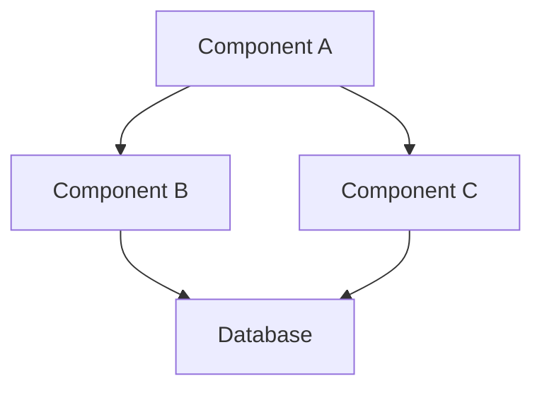
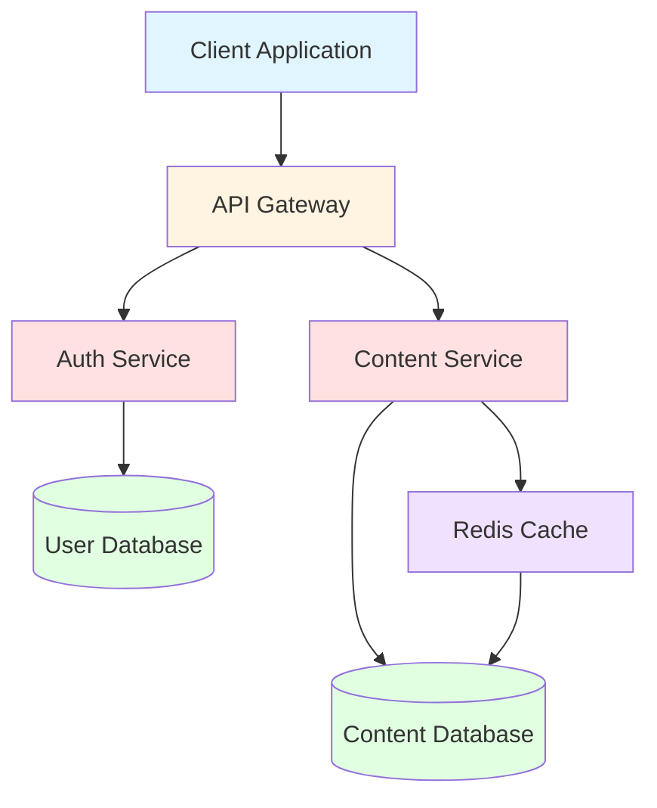
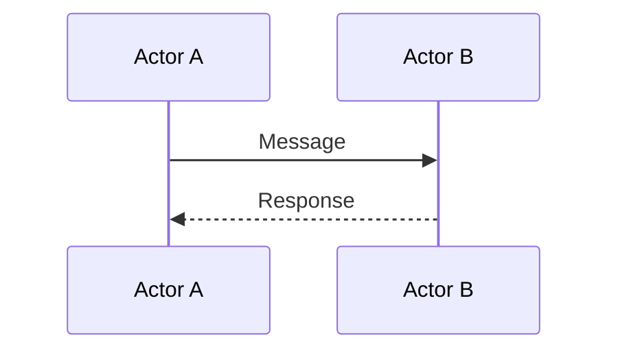
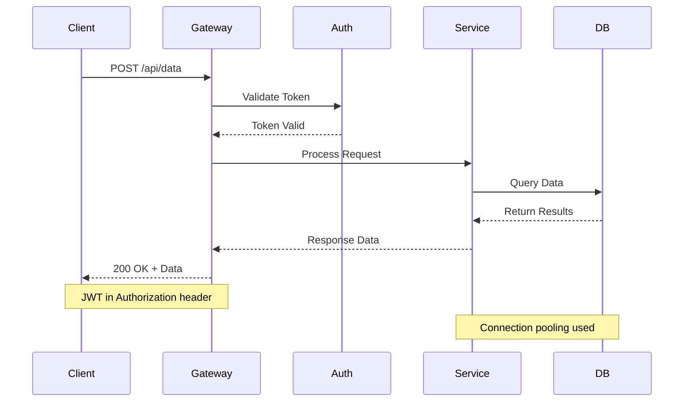
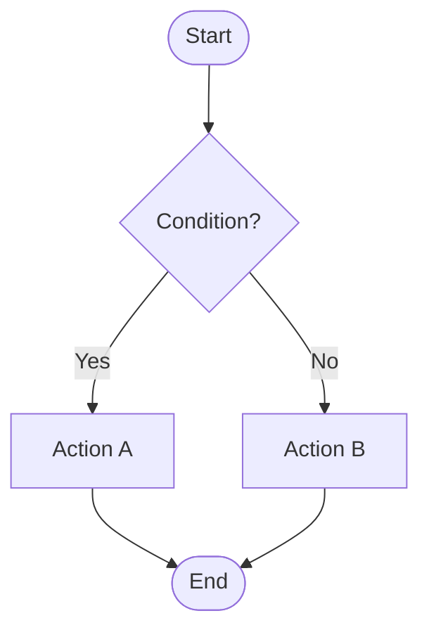
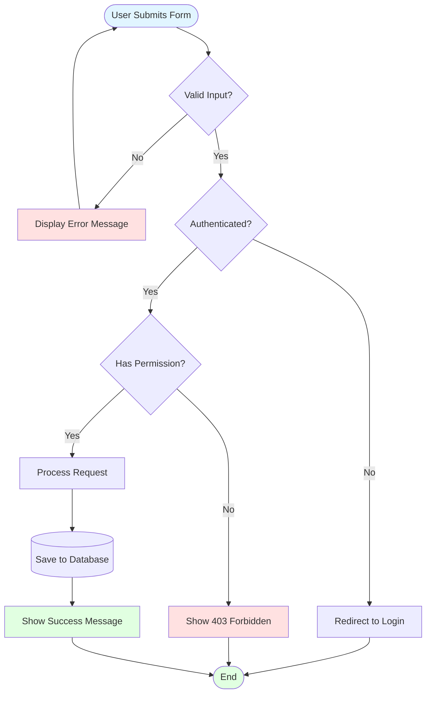
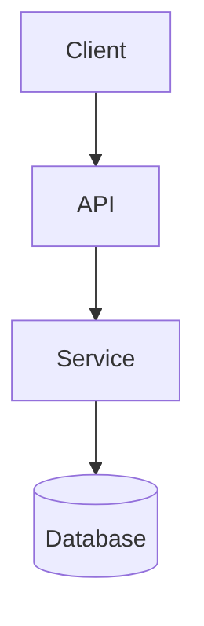
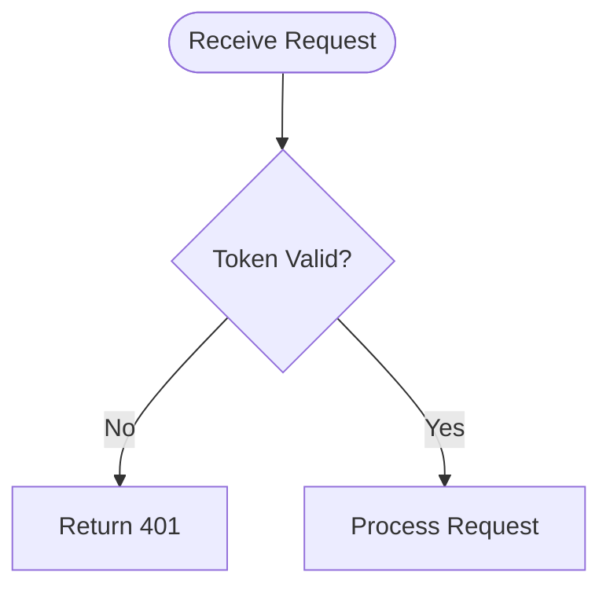

# Rich Elements Reference Guide

Use these Markdown elements to create engaging, informative ebook content. Each element serves a specific purpose in technical documentation.

---

## 1. Mermaid Diagrams

### When to Use
- **Architecture diagrams**: System components and relationships
- **Sequence diagrams**: Request/response flows, API interactions
- **Flowcharts**: Business logic, decision trees, algorithms

### Graph TD (Architecture Diagrams)

**When to use**: Show system architecture, component relationships, module dependencies.

**Syntax**:


**Complete Example**:


**Best Practices**:
- Use descriptive node names
- Group related components visually
- Add colors to distinguish layers (presentation, business logic, data)
- Keep diagrams under 12 nodes for readability

---

### Sequence Diagrams (Request Flows)

**When to use**: Illustrate API calls, authentication flows, multi-step interactions.

**Syntax**:


**Complete Example**:


**Best Practices**:
- Use clear participant names
- Add notes for important details (headers, error handling)
- Show both success and error paths when relevant
- Limit to 8-10 interactions for clarity

---

### Flowcharts (Business Logic)

**When to use**: Decision trees, algorithm steps, conditional logic flows.

**Syntax**:


**Complete Example**:


**Best Practices**:
- Use diamond shapes for decisions
- Use rounded rectangles for start/end
- Use rectangles for actions
- Use cylinders for database operations
- Add colors to indicate success (green), errors (red), neutral (blue)

---

## 2. Code Blocks with File Annotations

### When to Use
Show actual code examples from the codebase with context about where the code lives.

### Syntax
```language
// path/to/file.ext
code here
```

### Complete Example

```typescript
// src/services/auth.service.ts
import { Injectable } from '@nestjs/common';
import { JwtService } from '@nestjs/jwt';
import { User } from './user.entity';

@Injectable()
export class AuthService {
  constructor(private jwtService: JwtService) {}

  async login(user: User): Promise<string> {
    const payload = { email: user.email, sub: user.id };
    return this.jwtService.sign(payload);
  }

  async validateToken(token: string): Promise<boolean> {
    try {
      this.jwtService.verify(token);
      return true;
    } catch {
      return false;
    }
  }
}
```

**Best Practices**:
- Always include file path as first comment
- Use proper syntax highlighting (typescript, javascript, python, bash, etc.)
- Keep examples under 30 lines
- Remove unnecessary imports/code for clarity
- Add inline comments for complex logic

---

## 3. Tables

### When to Use
- Compare design decisions
- List configuration options
- Show API endpoints
- Feature comparison matrices

### Syntax
```
| Column 1 | Column 2 | Column 3 |
|----------|----------|----------|
| Data     | Data     | Data     |
```

### Complete Examples

#### Design Decision Comparison
| Approach | Pros | Cons | Verdict |
|----------|------|------|---------|
| **REST API** | Simple, widely supported, cacheable | Overfetching, multiple requests | ✅ Chosen for public API |
| **GraphQL** | Flexible queries, single endpoint | Complex setup, caching challenges | ❌ Overkill for our use case |
| **gRPC** | Fast, type-safe, streaming | Poor browser support, steep learning curve | ❌ Not web-friendly |

#### Configuration Options
| Option | Type | Default | Description |
|--------|------|---------|-------------|
| `port` | number | 3000 | Server port |
| `maxConnections` | number | 100 | Max concurrent connections |
| `timeout` | number | 30000 | Request timeout (ms) |
| `enableLogging` | boolean | true | Enable request logging |

#### API Endpoints
| Method | Endpoint | Auth | Description |
|--------|----------|------|-------------|
| GET | `/api/users` | Required | List all users |
| GET | `/api/users/:id` | Required | Get user by ID |
| POST | `/api/users` | Required | Create new user |
| PUT | `/api/users/:id` | Required | Update user |
| DELETE | `/api/users/:id` | Admin only | Delete user |

**Best Practices**:
- Use **bold** for column headers or important terms
- Add emojis for quick visual scanning (✅ ❌ ⚠️)
- Align columns for readability
- Keep cell content concise
- Use code formatting for technical values

---

## 4. Callout Blocks

### When to Use
Highlight important information, warnings, tips, or notes that readers should notice.

### Syntax
Use emoji + bold text at the start of a paragraph or blockquote.

### Complete Examples

#### 💡 Tip (Best Practices)
**💡 Tip**: Always validate user input on both client and server. Client-side validation improves UX, but server-side validation is essential for security.

#### ⚠️ Warning (Common Pitfalls)
**⚠️ Warning**: Never store JWT tokens in localStorage if your app is vulnerable to XSS attacks. Use httpOnly cookies instead.

#### 📝 Note (Additional Context)
**📝 Note**: This middleware runs on every request. Keep logic lightweight to avoid performance bottlenecks. Consider caching authentication results.

#### 🔒 Security (Security Considerations)
**🔒 Security**: Hash passwords with bcrypt (minimum 10 rounds) before storing. Never log or transmit passwords in plain text.

#### 🎯 Key Insight (Important Concepts)
**🎯 Key Insight**: The factory pattern here allows us to swap authentication strategies (JWT, OAuth, API keys) without changing business logic.

#### 🐛 Debug Tip (Troubleshooting)
**🐛 Debug Tip**: If authentication fails intermittently, check token expiration times and clock synchronization between services.

#### 📊 Performance (Optimization Notes)
**📊 Performance**: This query triggers a full table scan. Add an index on `user_id` to reduce query time from 2s to 50ms.

### Callout Pattern Mapping

**From course interactive elements to ebook static equivalents:**

| Course Element | Ebook Callout | Purpose |
|----------------|---------------|---------|
| Quiz question | 🤔 **Think About It**: ... | Engage critical thinking |
| Interactive demo | 💡 **Try This**: ... | Encourage experimentation |
| Warning popup | ⚠️ **Warning**: ... | Highlight pitfalls |
| Info tooltip | 📝 **Note**: ... | Provide context |
| Best practice badge | ✅ **Best Practice**: ... | Show recommended approach |

**Best Practices**:
- Use one callout per concept
- Place callouts immediately after relevant code/text
- Keep callout text under 3 sentences
- Use bold formatting for the callout prefix
- Choose emoji that matches the message type

---

## 5. Directory Trees

### When to Use
Show project structure, file organization, folder hierarchy.

### Syntax
Use plain text with indentation and tree characters.

### Complete Example

```
project-root/
├── src/
│   ├── controllers/
│   │   ├── auth.controller.ts
│   │   ├── user.controller.ts
│   │   └── post.controller.ts
│   ├── services/
│   │   ├── auth.service.ts
│   │   ├── user.service.ts
│   │   └── email.service.ts
│   ├── models/
│   │   ├── user.model.ts
│   │   └── post.model.ts
│   ├── middleware/
│   │   ├── auth.middleware.ts
│   │   └── logging.middleware.ts
│   ├── config/
│   │   ├── database.config.ts
│   │   └── jwt.config.ts
│   └── app.module.ts
├── test/
│   ├── unit/
│   │   └── auth.service.spec.ts
│   └── e2e/
│       └── auth.e2e.spec.ts
├── package.json
├── tsconfig.json
└── README.md
```

**With Annotations**:

```
project-root/
├── src/                          # Application source code
│   ├── controllers/              # HTTP request handlers
│   │   ├── auth.controller.ts    # Authentication endpoints
│   │   ├── user.controller.ts    # User CRUD operations
│   │   └── post.controller.ts    # Post management
│   ├── services/                 # Business logic layer
│   │   ├── auth.service.ts       # Auth logic (JWT generation, validation)
│   │   ├── user.service.ts       # User business rules
│   │   └── email.service.ts      # Email sending (uses SendGrid)
│   ├── models/                   # Database schemas
│   │   ├── user.model.ts         # User entity (TypeORM)
│   │   └── post.model.ts         # Post entity
│   ├── middleware/               # Request pipeline interceptors
│   │   ├── auth.middleware.ts    # JWT validation middleware
│   │   └── logging.middleware.ts # Request/response logging
│   ├── config/                   # Configuration files
│   │   ├── database.config.ts    # PostgreSQL connection settings
│   │   └── jwt.config.ts         # JWT secret and expiration
│   └── app.module.ts             # NestJS root module
├── test/                         # Test suites
│   ├── unit/                     # Unit tests (isolate services)
│   └── e2e/                      # End-to-end tests (full API)
├── package.json                  # Dependencies
├── tsconfig.json                 # TypeScript config
└── README.md                     # Project documentation
```

**Focused View (Highlight Specific Files)**:

```
src/
├── services/
│   ├── auth.service.ts           ← We'll modify this
│   ├── user.service.ts
│   └── email.service.ts
└── middleware/
    └── auth.middleware.ts        ← This calls auth.service
```

**Best Practices**:
- Use `├──` for intermediate items, `└──` for last items
- Indent with 4 spaces or `│   ` for alignment
- Add comments with `#` for clarity
- Show only relevant parts of large projects
- Use arrows (←) to highlight files being discussed
- Limit depth to 4-5 levels maximum

---

## 6. Combining Elements

### Effective Patterns

#### Pattern 1: Diagram → Code → Callout
Show architecture, then implementation, then insight.



```typescript
// src/services/user.service.ts
async findUser(id: string): Promise<User> {
  return this.userRepository.findOne({ where: { id } });
}
```

**💡 Tip**: The repository pattern here abstracts database operations, making it easy to swap PostgreSQL for MongoDB without changing business logic.

---

#### Pattern 2: Table → Directory Tree
Compare approaches, then show the chosen structure.

| Approach | File Organization |
|----------|-------------------|
| **Layered** | Organize by technical layer (controllers/, services/) |
| **Feature-based** | Organize by feature (users/, posts/) |

We chose **layered** for this project:

```
src/
├── controllers/
├── services/
└── models/
```

---

#### Pattern 3: Flowchart → Code → Warning
Show logic flow, implement it, then warn about edge cases.



```typescript
// src/middleware/auth.middleware.ts
if (!isValidToken(token)) {
  return res.status(401).json({ error: 'Unauthorized' });
}
```

**⚠️ Warning**: This middleware blocks the entire request pipeline. If token validation is slow (e.g., calling external auth service), consider caching results for 5 minutes.

---

## 7. Quick Reference: When to Use Each Element

| Element | Best For | Avoid For |
|---------|----------|-----------|
| **Graph TD** | System architecture, component relationships | Sequential processes (use sequence diagram) |
| **Sequence Diagram** | API flows, request/response cycles | Static relationships (use graph TD) |
| **Flowchart** | Decision logic, algorithms | Simple linear steps (use numbered list) |
| **Code Block** | Actual implementation, syntax examples | Pseudocode (use plain text) |
| **Table** | Comparisons, configurations, structured data | Long explanations (use paragraphs) |
| **Callout** | Warnings, tips, insights | Primary content (use body text) |
| **Directory Tree** | Project structure, file organization | Single file paths (just mention filename) |

---

## 8. Writing Guidelines

### Clarity
- One concept per element
- Use descriptive labels (not "A", "B", "C")
- Add context before complex diagrams

### Consistency
- Use the same colors/styles across diagrams in a chapter
- Use the same emoji types for similar callouts
- Use the same file path format (relative vs absolute)

### Balance
- Don't overuse any single element type
- Mix visual (diagrams) and textual (code, tables) elements
- Use whitespace between elements

### Accessibility
- Describe diagram content in surrounding text
- Don't rely solely on color to convey meaning
- Use alt text concepts (explain what the diagram shows)

---

**End of Reference Guide**
